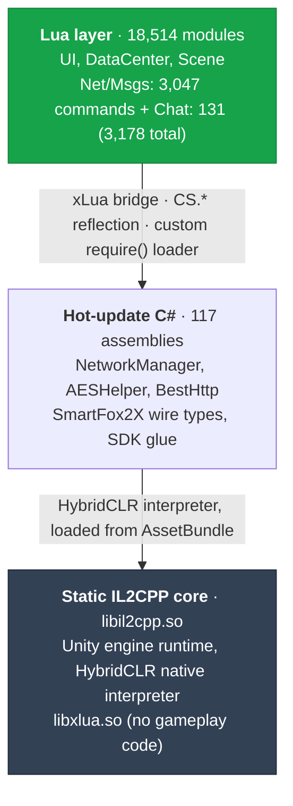

This is an unofficial reverse-engineering dossier, assembled for interoperability research. It's a from-the-APK reconstruction of the client architecture, the gate-server crypto, the SmartFoxServer wire protocol, and the full 3,178-command protocol surface, assembled to spec a compatible Go client.

| Metric | Value |
|---|---|
| Research agents | 13 |
| Network commands | 3,178 |
| Lua modules | 18,514 |
| C# assemblies | 117 |
| Data tables | 1,279 |
| Custom formats cracked | 3 |

<CardGroup cols={2}>
  <Card title="Extraction methodology" icon="key" href="/methodology">
    How the three custom, undocumented file formats were reverse-engineered from first principles.
  </Card>
  <Card title="Live validation" icon="flask" href="/live-validation">
    What's been confirmed by actually round-tripping traffic against production, versus what's static-analysis-only.
  </Card>
  <Card title="Go implementation roadmap" icon="road" href="/go-client-roadmap">
    What a compatible Go client needs to implement, and in what order.
  </Card>
  <Card title="Game entity ID reference" icon="table" href="/entity-id-reference">
    The full catalog of game entity IDs recovered from the data tables.
  </Card>
</CardGroup>

Last War is a Unity game with almost none of its logic compiled into the app you download. Three independent, independently-updatable layers sit on top of a thin native core, and only the crypto and wire protocol are what a Go client needs to reimplement.

## Client architecture

The client is built on Unity + IL2CPP, but IL2CPP compiles almost nothing of the game itself. Instead:

- **Gameplay logic and UI**, city building, army/hero systems, world map, alliance, chat, mail, shop, and essentially every one of the 3,178 network commands, is written in **Lua** (18,514 compiled modules, hot-updated as one bundle).
- **Engine glue and platform integration**, the network stack, the crypto, asset/resource management, and third-party SDK wiring, lives in **hot-updatable C#**, shipped as 117 hot-swappable assemblies via [HybridCLR](https://github.com/focus-creative-games/hybridclr), interpreted at runtime rather than AOT-compiled.
- **The static core**, `libil2cpp.so`, the Unity engine runtime, and the native HybridCLR/xLua interpreters, is what's actually fixed at app-store-release granularity. It contains no game logic at all (confirmed empirically, see [Native binaries & security](/native-binaries)).

Two transports carry traffic to FunPlus's servers:

- **HTTP(S)** for bootstrap, version check, hot-update manifests, and gate-server discovery (the "GSL" flow), wrapped in a custom RSA+AES hybrid scheme.
- **A raw TCP socket** speaking a hand-rolled reimplementation of [SmartFoxServer 2X](https://www.smartfoxserver.com/)'s binary `SFSObject` protocol, carrying every gameplay command as a string `cmd` (e.g. `"mail.read"`) plus a typed key/value payload.

### Layer diagram

### What a Go client actually needs

Only two of these three layers matter for protocol compatibility: the **crypto** ([Gate-server crypto](/gate-server-crypto)) and the **wire format** ([SFS2X wire protocol](/wire-protocol), [Command reference](/command-reference)). The Lua/C# split is a client-implementation detail, a Go client talks TCP and HTTP directly and never touches Lua. The [native-binary survey](/native-binaries) exists to answer one practical question: does anything below the protocol layer (anti-cheat, device attestation, signing) block a clean-room client?

<Check>
  **Short answer**: no, for creating and driving new guest accounts, and for binding a guest session to a real account via email verification, both confirmed live, end to end, repeatedly. Reconnecting into an *already-established* account's live game state is confirmed live too, including against the shipped code after a security fix swapped part of the `ta` blob for placeholders (an unattended cron reconnected and collected real resources over multiple days, August 2026). It's just not yet fully general-purpose: it still needs a captured access token and server address, see [Native binaries & security](/native-binaries) and [Live validation against production](/live-validation) for the full scope and current state.
</Check>
